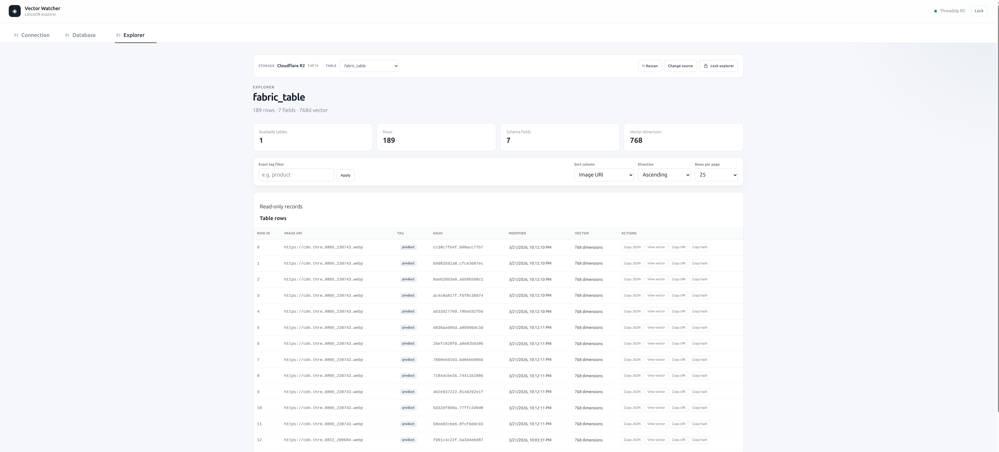

# Vector Watcher

A desktop LanceDB explorer for inspecting vector databases stored locally or on S3-compatible object storage.



## Overview

Vector Watcher provides a desktop interface for connecting to a LanceDB database, inspecting its structure, and exploring vector records.

The current implementation is built with:

* React
* TypeScript
* Vite
* Tauri
* FastAPI
* Python 3.12+
* Poetry
* LanceDB
* S3-compatible storage
* Cloudflare R2

The application is currently developed as a local desktop tool. The React frontend runs through Vite during development, while the FastAPI backend provides the LanceDB API layer.

## Features

### Connection

Connect to LanceDB using:

* Cloudflare R2
* Amazon S3
* Local LanceDB storage

The connection interface supports storage credentials, database path configuration, connection testing, and disconnecting.

Credentials are kept in application memory and are not stored in browser local storage.

### Database

Inspect the connected database and its tables.

The database view provides information about:

* Available tables
* Row count
* Schema
* Vector dimensions
* Schema metadata
* Embedding metadata

### Explorer

Explore records from a selected LanceDB table.

Current functionality includes:

* Paginated records
* Tag filtering
* Sorting
* Row metadata
* Image URI inspection
* Hash inspection
* Vector dimension information
* Copy actions
* Vector inspection

### Lock

The explorer can be locked from the application toolbar while keeping the current session available.

The lock mechanism will be expanded as the application's credential/session security model evolves.

## Architecture

```text
┌───────────────────────────────┐
│       Vector Watcher          │
│       React + TypeScript      │
└───────────────┬───────────────┘
                │
                │ HTTP
                ▼
┌───────────────────────────────┐
│        FastAPI Backend        │
│          Python 3.12          │
└───────────────┬───────────────┘
                │
                ▼
┌───────────────────────────────┐
│            LanceDB            │
└───────────────┬───────────────┘
                │
                ▼
┌───────────────────────────────┐
│     Local / S3 / Cloudflare   │
│             R2                │
└───────────────────────────────┘
```

## Project Structure

```text
vector-watcher/
├── backend/
│   ├── .env
│   ├── .venv/
│   ├── main.py
│   ├── models/
│   ├── services/
│   ├── pyproject.toml
│   ├── poetry.lock
│   └── README.md
│
├── src/
│   ├── api/
│   │   └── lancedbAdmin.ts
│   ├── components/
│   │   ├── ConnectionTab.tsx
│   │   ├── DatabaseTab.tsx
│   │   ├── ExplorerTab.tsx
│   │   ├── LanceFilterBar.tsx
│   │   ├── LanceMetadataPanel.tsx
│   │   ├── LancePagination.tsx
│   │   ├── LanceRowGrid.tsx
│   │   ├── LanceScanToolbar.tsx
│   │   ├── LanceSchemaPanel.tsx
│   │   ├── LanceSourceScanner.tsx
│   │   ├── LanceSummaryCards.tsx
│   │   └── VectorViewer.tsx
│   ├── lib/
│   │   └── explorerUtils.ts
│   ├── App.tsx
│   ├── App.css
│   └── main.tsx
│
├── src-tauri/
├── .env.local
├── screenshot.png
├── package.json
└── README.md
```

## Requirements

### Frontend

* Node.js 22+
* npm

### Backend

* Python 3.12+
* Poetry

### Storage

For remote LanceDB databases, an S3-compatible storage provider can be used.

The current development setup has been tested with Cloudflare R2.

## Backend Setup

Move into the backend directory:

```bash
cd backend
```

Configure Poetry to keep the virtual environment inside the project:

```bash
poetry config virtualenvs.in-project true --local
```

Install dependencies:

```bash
poetry install
```

The backend uses:

```text
backend/.venv/
```

as its Python environment.

## Backend Environment

Create:

```text
backend/.env
```

and configure the required storage credentials.

Do not commit `.env` to Git.

Example:

```env
R2_ACCOUNT_ID=your-account-id
R2_ACCESS_KEY_ID=your-access-key
R2_SECRET_ACCESS_KEY=your-secret-key
R2_BUCKET=your-bucket
R2_ENDPOINT=https://your-account-id.r2.cloudflarestorage.com
R2_PATH=table
```

Use the actual environment variable names expected by the backend configuration.

## Start the Backend

From the `backend` directory:

```bash
poetry run uvicorn main:app --host 127.0.0.1 --port 8765
```

For development with automatic reload:

```bash
poetry run uvicorn main:app --host 127.0.0.1 --port 8765 --reload
```

The API is then available at:

```text
http://127.0.0.1:8765
```

## Frontend Setup

From the repository root:

```bash
npm install
```

Start the Vite development server:

```bash
npm run dev
```

The frontend is available at:

```text
http://localhost:1420
```

The frontend communicates with the backend on port `8765`.

## Development

Run the two services separately:

### Terminal 1

```bash
cd backend
poetry run uvicorn main:app --host 127.0.0.1 --port 8765 --reload
```

### Terminal 2

```bash
npm run dev
```

Then open:

```text
http://localhost:1420
```

## API

The FastAPI backend currently exposes operations for:

* Health checking
* Testing connections
* Scanning LanceDB sources
* Inspecting tables
* Reading table schema and metadata
* Reading paginated rows
* Reading individual rows and vectors

The API is intended to remain a thin local layer between the desktop application and LanceDB.

## Current Test Database

The current development setup has been successfully tested against a Cloudflare R2 LanceDB database containing:

```text
Table:       fabric_table
Rows:        189
Fields:      7
Vector size: 768
```

The table contains fields including:

```text
vector
image_uri
tag
hash
mtime
embedding_created_at
size
```

## Security

The application is intended to run locally.

Important rules:

* Never commit `.env`.
* Never commit access keys or secret keys.
* Never put R2 credentials in the React `.env` file.
* Do not store storage credentials in `localStorage`.
* Keep the FastAPI service bound to `127.0.0.1` during local development.
* Use explicit CORS origins for the development frontend.

The current development frontend uses:

```text
http://localhost:1420
http://127.0.0.1:1420
```

## Build

Build the React frontend:

```bash
npm run build
```

The Tauri desktop application can then be developed and packaged using the project's existing Tauri configuration.

## Roadmap

Planned improvements include:

* Account ID-based Cloudflare R2 configuration
* Automatic R2 endpoint generation
* Improved credential/session locking
* Image previews
* Detailed row inspection
* Better vector visualization
* Search improvements
* Advanced filtering
* Tauri-managed FastAPI backend process
* Production desktop packaging
* Additional LanceDB operations

## License

License information will be added as the project is prepared for release.
