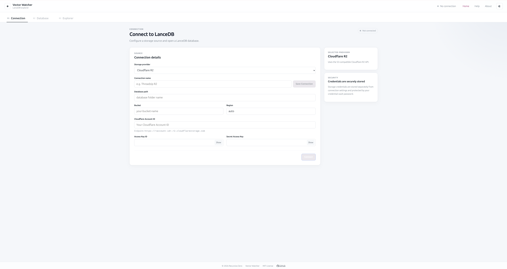

# Vector Watcher

Vector Watcher is a cross-platform desktop application built with **Tauri**, **React**, **TypeScript**, and a local **Python/FastAPI backend**.

The application packages the frontend, Tauri application, and Python backend into a single desktop application for:

* Linux
* macOS
* Windows

The Python backend runs locally and is started automatically when Vector Watcher launches.

---

## Screenshots



---

## Features

> TODO: Add the confirmed user-facing features.

Current documentation areas include:

* Database connections
* Saved connections
* Database exploration
* Tables
* Search

See the full documentation in the **Wiki**.

---

## Installation

Download the latest release for your operating system from:

> TODO: Add GitHub Releases link

---

## Documentation

Full documentation is available in the GitHub Wiki.

```text
https://github.com/recursivezero/vector-watcher/wiki
```

The Wiki includes:

### User Documentation

* Getting Started
* Connections
* Saved Connections
* Database Explorer
* Tables
* Search
* Settings
* About

### Developer Documentation

* Architecture
* Development Setup
* Backend Packaging
* Backend Sidecar
* Linux Builds
* macOS Builds
* Windows Builds
* Release Workflow
* Troubleshooting

---

## Architecture

```text
React / TypeScript
        │
        ▼
Tauri Desktop Application
        │
        ▼
Python Backend Sidecar
        │
        ▼
FastAPI / Uvicorn
        │
        ▼
127.0.0.1:8765
```

---

## Development

Frontend dependencies:

```bash
npm install
```

Backend dependencies:

```bash
cd backend
poetry install
```

For complete development and build instructions, see the Wiki.

---

## Building

Platform-specific builds are documented in the Wiki:

* Linux
* macOS
* Windows

---

## License

MIT

---

## Contributing

* Keshav Mohta
* Dhwani Khandelwal

---

## Support

For bugs, feature requests, and support:

[Issue Page](https://github.com/recursivezero/vector-watcher/issues)
