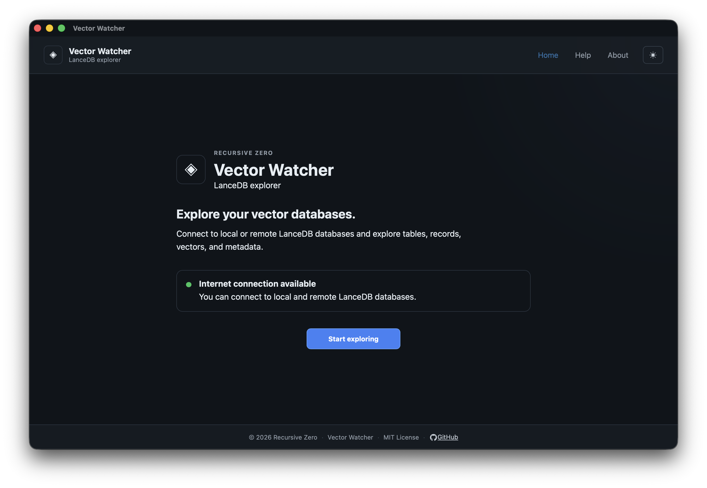
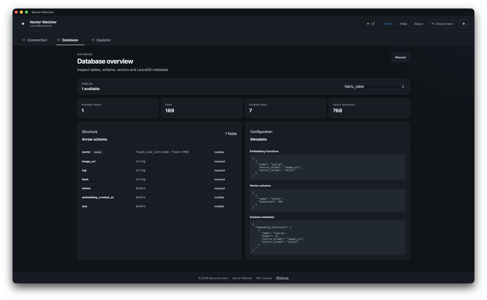
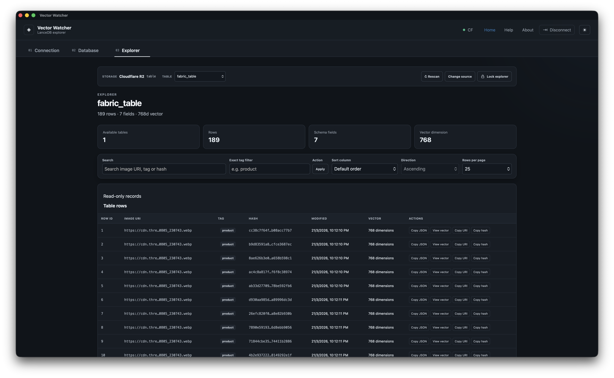
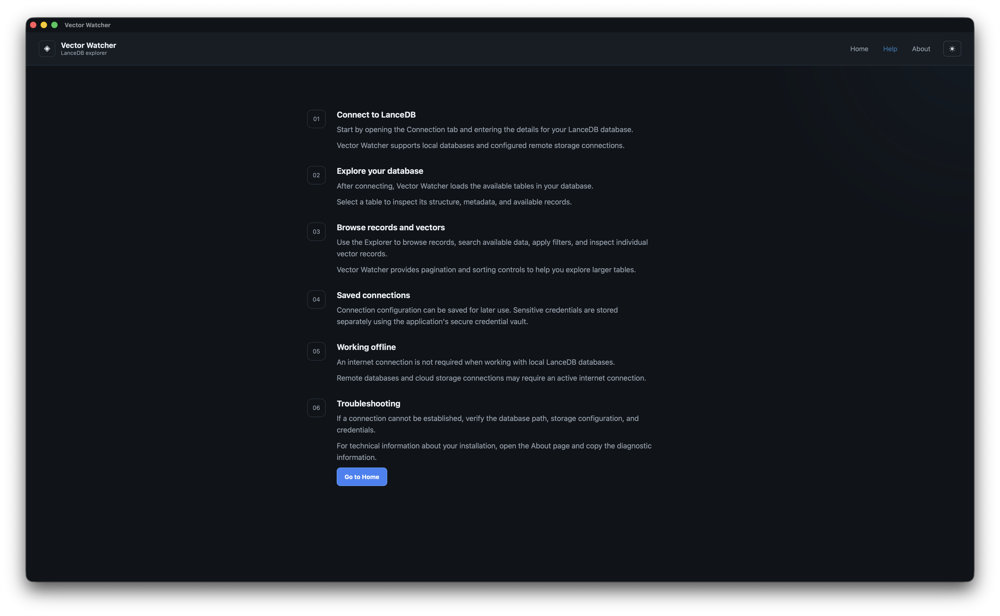
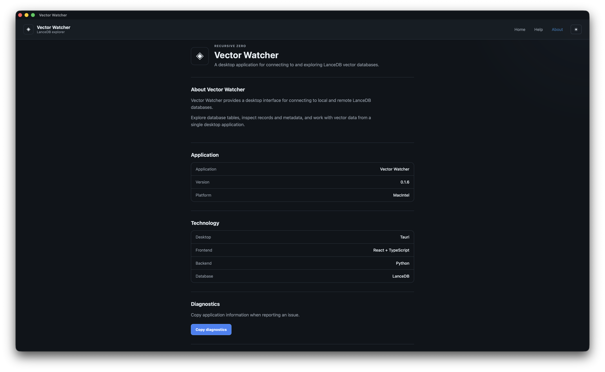

# Vector Watcher

Vector Watcher is a cross-platform desktop application built with:

- Tauri
- React
- TypeScript
- Rust
- Python
- FastAPI

The Python backend is packaged as a native sidecar using PyInstaller.

Vector Watcher packages the frontend, Rust/Tauri application, and Python backend into a single desktop application for:

- Linux
- macOS
- Windows

The Python backend runs locally and is started automatically when the Tauri application launches.

---

## Screenshots

---

## Documentation

### Getting Started

- [[Requirements]]
- [[Development]]
- [[Project Structure]]

### Architecture

- [[Architecture]]
- [[Backend Packaging]]
- [[Backend Sidecar]]
- [[Cross Platform Builds]]

### Building Releases

- [[Linux]]
- [[macOS]]
- [[Windows]]
- [[Release Workflow]]
- [[Release Checklist]]

### Help

- [[Troubleshooting]]
