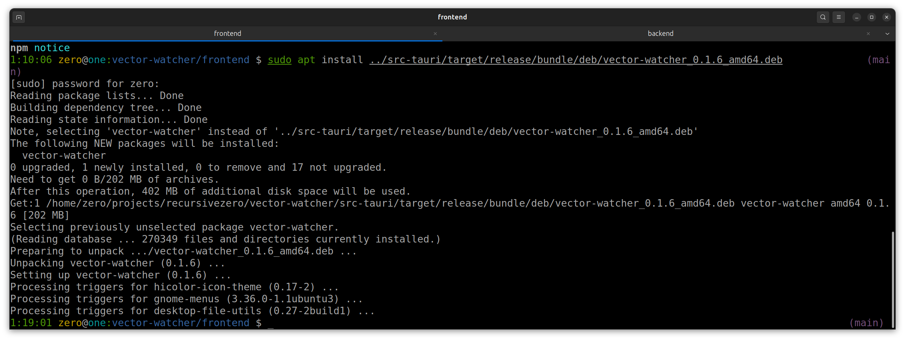

# Linux

This page describes building and installing Vector Watcher on Linux.

The current documented target is Ubuntu and Debian-based distributions.

---

## Build the Backend

```bash
cd backend
./build.sh
```

## Build the Tauri Application

From the project root:

```bash
cd frontend
npm run clean
npm run tauri:build:linux
```

Recommended _package.json_ script:

```json
{
  "scripts": {
    "tauri:build:linux": "cd .. && tauri build --config src-tauri/tauri.prod.conf.json --bundles deb"
  }
}
```

### Generated Package

The package is generated under: _src-tauri/target/release/bundle/deb/_

Example: Vector Watcher_1.1.0_amd64.deb

### Install on Ubuntu

`sudo apt install "./src-tauri/target/release/bundle/deb/Vector Watcher_1.1.0_amd64.deb"`

Or:

```bash
sudo apt install "/absolute/path/to/Vector Watcher_1.1.0_amd64.deb"
```

### Launch

After installation:

`vector-watcher`

You can also launch Vector Watcher from the Ubuntu application launcher.

### Screenshots



📷 Screenshot placeholder: Installed Vector Watcher application

📷 Screenshot placeholder: Terminal installation command
