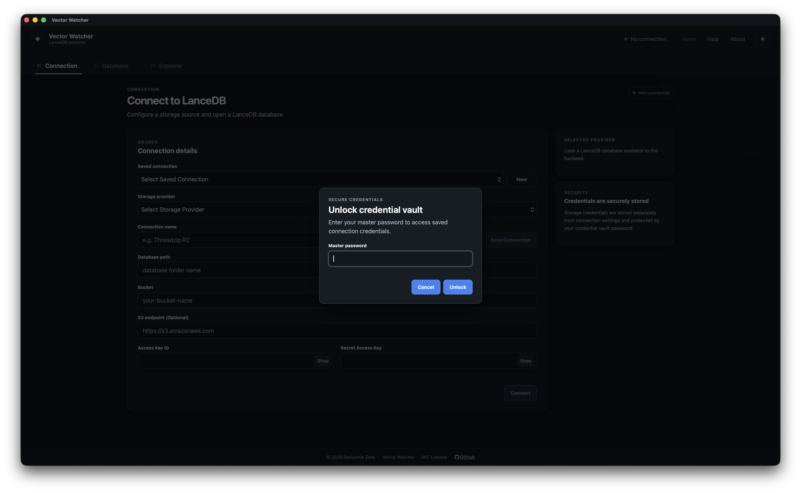
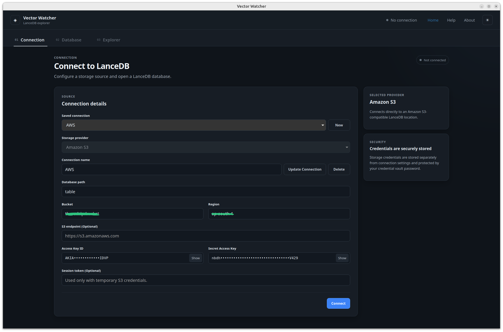

# Saved Connections

Saved connections allow previously configured connection settings to be reused.

This avoids entering the same connection information every time Vector Watcher is opened.

---

## Saving a Connection

After entering connection details, save the connection using the available save action.

it will ask to generate secret vault on your system and will store there so next time when you select a saved connection from the dropdown then it will ask the vault password

---

## Selecting a Saved Connection

Select an existing saved connection from the available connection list.

After selecting a connection, load or connect using the appropriate application action.

---

## Managing Saved Connections

Possible management operations include:

- Loading a saved connection
- Updating a saved connection
- Deleting a saved connection
- Renaming a saved connection

Only document options that are available in the released application version.

---

## Security

credentials or sensitive connection information are stored in secret vault on your system

---

## Related Documentation

- [[Connections]]
- [[Settings]]
