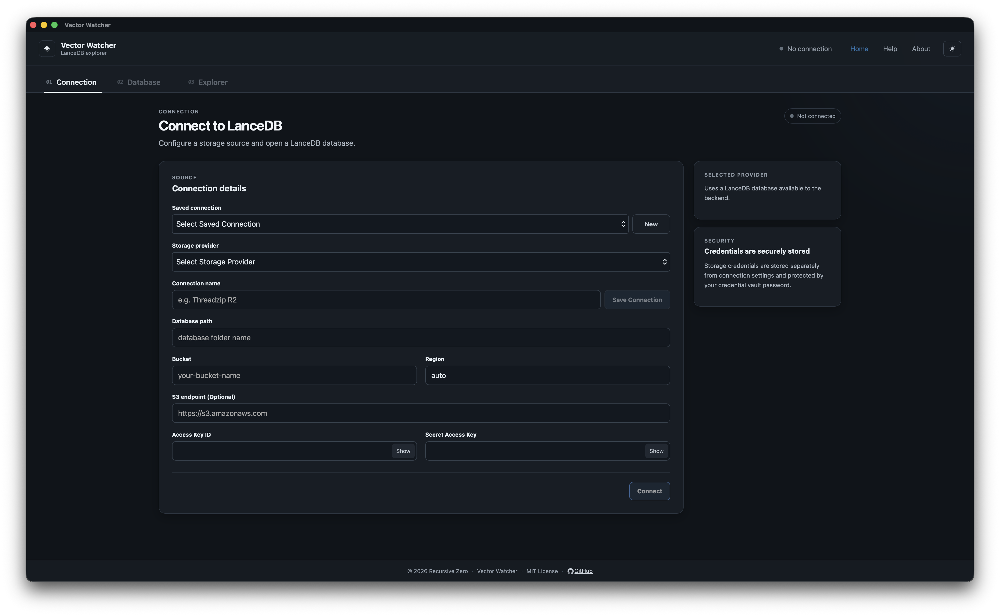

# Vector Watcher

Vector Watcher is a cross-platform desktop application built with:

- Tauri
- React
- TypeScript
- Rust
- Python
- FastAPI

The Python backend is packaged as a native sidecar using PyInstaller.

Vector Watcher packages the frontend, Rust/Tauri application, and Python backend into a single desktop application for:

- Linux
- macOS
- Windows

The Python backend runs locally and is started automatically when the Tauri application launches.

---

## Screenshots

---

## Documentation

### Getting Started

- [Requirements](./Requirements.md)
- [Development](./Development.md)
- [Project Structure](./Project-Structure.md)

### Architecture

- [Architecture](./Architecture.md)
- [Backend Packaging](./Backend-Packaging.md)
- [Backend Sidecar](./Backend-Sidecar.md)
- [Cross Platform Builds](./Cross-Platform-Builds.md)

### Building Releases

- [Linux](./Linux.md)
- [macOS](./macOS.md)
- [Windows](./Windows.md)
- [Release Workflow](./Release-Workflow.md)
- [Release Checklist](./Release-Checklist.md)

### Help

- [Troubleshooting](./Troubleshooting.md)
